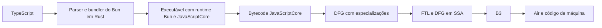

# Otimizações do Bun/JavaScriptCore aplicáveis ao backend Rust do scriptc

Data: 2026-09-09
Pedido: clonar o Bun em outro diretório e estudar suas otimizações de IR.
Escopo: código oficial do Bun, JavaScriptCore usado pelo Bun e o caminho de loops de bytes do scriptc. Não compilamos nem instalamos outra versão do Bun.

## Resultado

O Bun atual tem seu runtime e vários componentes de parsing/bundling em Rust. Seu README o declara explicitamente e o workspace Cargo confirma isso [B1, B2]. A execução de JavaScript continua usando JavaScriptCore, cujos passes examinados são C++. Portanto, a migração da implementação do Bun para Rust não transforma `bun build --compile` em uma tradução AOT do programa TypeScript para Rust [B1, B3, J1].

Para o scriptc, a principal oportunidade é preservar e provar informações de alto nível antes de emitir Rust: intervalos inteiros, identidade e limites das views, efeitos das chamadas e ausência de escapes. O JavaScriptCore faz trabalho explícito nessas áreas antes da geração final de código [J1–J7]. Isto é uma recomendação de arquitetura baseada no código, ainda não uma atribuição medida da diferença de tempo do Redwall.

## Checkouts e versões

- Bun: `/tmp/scriptc-research/bun`, clone raso com filtro de blobs, commit `5f554969bc8ab2159583cdf5ff26f5277ca35e91`; `LATEST` contém `1.4.2` [B5]. Checkout limpo após o clone.
- JavaScriptCore: `/tmp/scriptc-research/WebKit`, checkout esparso em `dfd696443b9ba87c4f516d1c724f0abacdd8768a`, o pin declarado pelo Bun clonado [B4]. Inclui DFG, FTL, B3, bytecompiler e bytecode.
- Bun instalado e usado no benchmark: `1.4.1+4661e494f`. O arquivo oficial de dependências desse commit declara WebKit `6119947592b6e1c1faef02a4c2e03174cf05d062` [B6]; também foi buscado no clone WebKit para comparação. Esse é o pin de fonte, não uma inspeção dos flags usados para construir o executável instalado.
- `DFGPlan.cpp`, `DFGIntegerRangeOptimizationPhase.cpp`, `DFGIntegerCheckCombiningPhase.cpp`, `DFGLICMPhase.cpp`, `DFGStrengthReductionPhase.cpp`, `B3ReduceStrength.cpp` e `B3Generate.cpp` não apresentam diferenças entre esses dois commits de WebKit. Outros arquivos, incluindo parser DFG, fixup e lowering FTL, mudaram. Não extrapolar a igualdade para o engine inteiro.
- Evidência local de versões: `/tmp/scriptc-research/bun-benchmark-webkit.ts` e os dois objetos Git do WebKit. O clone ocupa aproximadamente 321 MiB; o checkout esparso do WebKit, 117 MiB no momento da inspeção.

## Caminho de compilação

O gráfico simplifica os níveis de execução: código frio pode continuar no interpretador ou no JIT baseline; não é obrigatório que uma função chegue ao FTL. `--bytecode` antecipa o parsing e geração de bytecode para o build. O Bun clonado também documenta otimização desse bytecode e `compile.jitPolicy`, que altera os limiares para subir de nível no JIT [B3]. Nenhuma dessas flags foi aplicada ao controle de Bun que já vinha sendo medido.

O caminho relevante do scriptc continua sendo frontend TypeScript → IR tipada → Rust → rustc. O build Rust corrente usa `opt-level=2` em `packages/compiler/src/backend/rust/compile.ts`. O backend padrão do rustc usa LLVM: fortalecer nosso backend Rust significa entregar representações melhores ao rustc, e não demonstrar superioridade sobre LLVM apenas por trocar a linguagem emitida.

## O que estudar e o que transferir

| Mecanismo confirmado | Código de referência | Aplicação proposta ao scriptc |
|---|---|---|
| Seleção de representações numéricas e de arrays | `DFGFixupPhase.cpp` [J2] | Manter valores comprovadamente inteiros em representação inteira ao longo das operações, reconvertendo para `number` nas observações que exigem a semântica JS. |
| Relações entre valores, limites e condições | `DFGIntegerRangeOptimizationPhase.cpp` [J3] | Analisar `0 <= i < length` e intervalos de expressões derivadas, com prova de overflow e zero negativo. |
| Combinação de verificações de índices relacionados | `DFGIntegerCheckCombiningPhase.cpp` [J4] | Aproveitar acessos a pixels como `base`, `base+1`, `base+2`, `base+3` quando todos pertencem à mesma view e os limites são provados. |
| Movimentação de invariantes com efeitos explícitos | `DFGLICMPhase.cpp` e `DFGClobberize.h` [J5, J6] | Tirar do loop consultas de representação/comprimento e outras leituras estáveis somente quando nenhuma escrita ou chamada as invalida. |
| Reconhecimento de operações do runtime pelo compilador | Registro de acessores em `JSBuffer.cpp` [B7] | Preservar operações semânticas como acesso a byte/word na IR até que tipos, limites e endianness estejam resolvidos. |
| Análise de escapes e adiamento de alocações | `DFGObjectAllocationSinkingPhase.cpp` [J7] | Expandir a eliminação de células e objetos temporários que não escapam; priorizar conforme medições. |
| Orçamento para inlining e especialização | `DFGByteCodeParser.cpp` [J8] | Evitar crescimento ilimitado do Rust gerado e do binário ao especializar funções e loops. |
| Otimizações em camadas e validação da IR | `DFGPlan.cpp` e `B3Generate.cpp` [J1, J9] | Ter passes com pré-condições, invalidação de análises e validação explícitas, antes de delegar as otimizações de máquina ao rustc. |

### Intervalos: a lição mais diretamente aplicável

O IRO do JSC mantém relações entre nós e propaga fatos entre blocos. Para eliminar `CheckInBounds`, exige simultaneamente que o índice seja não negativo e menor que aquele comprimento. Para remover checagens de overflow de soma, verifica combinações dos extremos dos intervalos. Também trata explicitamente zero negativo em multiplicações [J3].

No scriptc, `packages/compiler/src/ir/integer-loops.ts` reconhece atualmente o caso canônico `for (let i = 0; i < bytes.length; i++)`. `backend/rust/integer-loops.ts` mantém o índice como `usize`, mas suas leituras comuns continuam aparecendo como `f64`, e a especialização direta de índices reconhece apenas referências à variável de indução. Isso deixa expressões como `row * stride + column * 4 + channel` fora desse caso específico. Essa observação é sobre os arquivos examinados, não uma alegação de que todo o compilador carece de otimizações.

Proposta: uma análise de fatos numéricos por expressão/bloco, começando com literais, leituras válidas de u8 e variáveis de indução. Fatos úteis: integralidade, finitude, limites inferior/superior, possibilidade de `-0` e dependências que justificam cada prova. Propagação conservadora através de soma, subtração, multiplicação por constantes e junções de controle. Valores desconhecidos mantêm o caminho atual.

Anotações TypeScript `number` sozinhas não provam integralidade nem ausência de NaN/Infinity. Não exigir do consumidor uma reescrita do algoritmo para contornar essa responsabilidade do compilador.

### Efeitos e ordem dos passes são parte da correção

LICM exige que uma operação não escreva memória e não leia algo que o loop escreve, além das condições de dominância e segurança de execução [J5]. O modelo de efeitos diferencia propriedades de typed arrays e casos redimensionáveis/compartilhados [J6].

O plano DFG registra que IRO deve ocorrer depois de LICM, porque movimentar operações pode invalidar relações usadas pelas provas. O IRO também mantém vivos nós usados como prova de limites ao retirar verificações de overflow [J1, J3]. Copiar apenas uma transformação aritmética e omitir suas dependências seria incorreto.

No scriptc já há uma análise estrutural conservadora para regiões de leitura em `backend/rust/byte-read-regions.ts`. Ela inspeciona chamadas diretas, recusa chamadas indiretas/recursivas e efeitos desconhecidos, tem orçamento e limita profundidade. É uma base útil, mas ainda não é um resumo reutilizável de efeitos para toda a IR.

### Buffer como operação que o compilador entende

O Bun registra tamanho, sinal, formato numérico e endianness dos acessores com o JSC. Operações de largura variável só são inlined quando a largura é uma constante admitida (1, 2 ou 4 nesse registro) [B7]. Isso evita que toda leitura seja apenas uma chamada opaca de runtime para o otimizador.

Para nós, vale manter `bytesIntrinsic` e fatos de view até emitir slices Rust e operações tipadas. Ainda é necessário preservar limites, aliases, ordem de avaliação e comportamento das exceções. Nenhum achado justifica introduzir `unsafe` no runtime Rust.

## Observação do JIT no executável que estamos comparando

Além da leitura do código, executamos o próprio Bun compilado do benchmark
com `BUN_JSC_reportCompileTimes=true`, usando os mesmos assets e entrada.
O processo saiu com código zero e o PNG manteve SHA256
`4d351ba412958507f0d266c76aebb64e83ff6eebaf9ab0a8886ee99ec5e065c6`.
O log confirma compilação DFG e FTL de `unfilter`, `toRgba`, `filtered` e
`paeth`; nas três primeiras também aparece `FTLForOSREntry`.

Evidência: `/tmp/scriptc-research/bun-jit.stderr`. Os milissegundos desse log
são tempo gasto **compilando funções**, não tempo de execução dessas funções.
Esta execução instrumentada está fora das amostras de desempenho. A opção
está declarada em `Source/JavaScriptCore/runtime/OptionsList.h` do pin antigo
(cópia local em `/tmp/scriptc-research/benchmark-jsc-options.h`).

Isso confirma que esses níveis do JIT participam da execução real. Ainda
não isola o benefício de cada passe nem explica sozinho o gap do scriptc.

### IR real de `filtered`: o que mudou

Uma segunda execução de diagnóstico usou
`BUN_JSC_dumpDFGFTLGraphAtEachPhase=true` e
`BUN_JSC_dumpGraphAllowlist=filtered`. Com compilação concorrente o processo
terminou antes de o dump percorrer todas as fases. Para obter o pipeline
completo, repetimos somente o diagnóstico com
`BUN_JSC_useConcurrentJIT=false`. Ambos produziram o PNG esperado; nenhum
foi incluído nas amostras de desempenho.

O dump completo está em `/tmp/scriptc-research/bun-filtered-ir-sync.stderr`
e a extração de nós em `/tmp/scriptc-research/filtered-ir-summary.json`.
Na segunda sequência de compilação, observamos:

- Antes de `fixup`: 9 `ValueAdd`, 8 `ValueSub` e 4 `ValueMul`. Depois de
  `fixup`, esses nós genéricos somem e aparecem operações `Arith*` com
  operandos inteiros. Isso demonstra especialização numérica concreta.
- Imediatamente antes de IRO: 22 nós `ArithAdd/Sub/Mul`, dos quais um já
  estava `Unchecked`. Depois de IRO, quatro estão `Unchecked`: três somas
  perdem checks de overflow, incluindo os incrementos nos bytecodes 273
  e 284. Comparação feita entre o snapshot anterior a IRO e o snapshot
  anterior ao passe seguinte (`clean up`), preservando os IDs dos nós.
- **Os seis nós `CheckInBounds` permanecem** nesses dois snapshots e no
  snapshot final de disponibilidade OSR. Portanto, esse dump não sustenta
  dizer que a vantagem do Bun em `filtered` vem de eliminar todos os
  bounds checks. B3 ainda pode transformar a representação posteriormente;
  este diagnóstico não examinou o código de máquina final.
- `GetIndexedPropertyStorage` cai de cinco antes de LICM para dois perto
  do fim da sequência. A contagem caracteriza a IR; não é uma medição de
  quantidade de acessos executados nem uma atribuição a um único passe.

A prioridade que esses dados reforçam é **propagação de representação
inteira e redução de conversões**, mantendo os checks que ainda precisam
existir. Otimização dos limites continua útil, mas não deve ser a única
hipótese para o gap do Redwall.

## Próximas implementações, em ordem

1. **Seleção de representação fora do loop: etapa concluída.** Os caminhos direto e genérico passaram pelos testes abaixo. A implementação em `statements.ts` escolhe duas versões por região, sem enumerar todas as combinações dos inputs. O ganho de desempenho permanece inconclusivo.
2. **Usar o comprimento do slice ativo na condição do loop.** A inspeção encontrou `emitFor` gerando `runtime::bytes_len_usize` mesmo quando leituras já usam um slice emprestado. Usar a mesma view na condição pode expor ao rustc a relação entre limite e indexação. Exigir testes de regiões aninhadas, aliases, view com offset, caminho backed e reatribuição. Medir; não presumir ganho.
3. **Propagar intervalos para índices derivados e aritmética de bytes.** Começar com um subconjunto demonstrável e corpus diferencial para overflow, limites, NaN/Infinity, `-0`, truncamento, aliases e caminhos que não entram no loop. Primeiro retirar conversões repetidas; só então avaliar quais checks o rustc já elimina em código seguro.
4. **Consolidar resumos de efeitos e identidade das views.** Reutilizar a prova para LICM, seleção de caminhos e chamadas puras. Recursão, suspensão, chamadas desconhecidas ou escrita via alias invalidam o fato relevante.
5. **Adicionar observabilidade das decisões do otimizador.** Registrar por função/loop quais especializações foram admitidas ou recusadas e por quê. Isso permitirá relacionar contagens estáticas com medições e direcionar o trabalho seguinte.
6. **Ampliar eliminação de alocações e inlining com orçamento.** Fazer após os loops de bytes e com evidência de custo. Não transplantar de início o pipeline completo de um JIT especulativo para nosso compilador AOT.

## Resultado da otimização que estava em andamento

A seleção de representação antes do loop foi validada em 12 testes focados,
no corpus C/LLVM sanitizado e em 38 contratos do renderer (26 chamadas
nativas com PNG idêntico). O relatório específico está em
`tests/dogfood/rust-byte-loop-versions.md`.

A rodada de sete amostras deu medianas de 1742,97 ms para o Rust anterior,
1652,03 ms para o candidato e 716,12 ms para Bun compilado. Todos os 24
resultados coincidiram. A mediana caiu 5,2%, mas o candidato venceu apenas
3 de 7 comparações na mesma rodada: o ganho permanece inconclusivo com a
variação atual da máquina. Ainda estamos a 2,31 vezes o tempo do Bun nessa
rodada. Esses números reforçam a necessidade de medir as propostas de IR;
a existência de código mais especializado não garante melhora estável.

## Experimentos numéricos derivados do estudo

Duas implementações foram medidas e rejeitadas; ambas foram retiradas da
emissão padrão. A primeira misturava operações i32 com armazenamento f64 e
introduziu 26 conversões saturadas em `filtered`, contra zero no controle.
A segunda especializava funções folha inteiras, sem conversões internas,
mas perdeu as sete rodadas pareadas: mediana 1234,85 ms contra 1215,93 ms
do controle Rust e 538,03 ms do Bun compilado. Todos os 24 outputs coincidiram.

O código experimental e os testes de análise foram preservados em
`.red/tmp/native-number-ranges-experiment-20260909/`; detalhes e caminhos
das medições estão em `tests/dogfood/rust-number-ranges.md`. O corpus 3133
permanece como proteção de semântica para trabalhos futuros. A evidência
reforça que conversões devem ser avaliadas ao longo de loops e índices
derivados; especializar `paeth` isoladamente não trouxe ganho.

## Inteiros ao longo de regiões de loops: resultado retido

Após rejeitar a especialização isolada de funções folha, implementamos
armazenamento i64 para contadores e índices derivados em regiões de bytes.
Uma verificação de parâmetros fora da região seleciona o caminho inteiro;
entradas não admitidas mantêm o caminho anterior. A análise exige exatidão
binary64, preserva -0/overflow e mantém os acessos verificados. O caso de
bindings internos de for-of ganhou um teste de regressão específico.

A rodada final teve 50 testes focados aprovados, corpus 3134 em C/LLVM
sanitizado e 38 contratos do renderer com 26 PNGs idênticos. Sete amostras
mais aquecimento deram mediana 1390,73 ms para Rust anterior, 1115,57 ms
para o candidato e 638,41 ms para Bun compilado. Os 24 outputs coincidiram;
o candidato venceu 6/7 rodadas e reduziu a mediana em 19,79%. O binário
encolheu 608 bytes. Ainda leva 1,75 vezes o tempo do Bun nessa rodada.

Evidência e limites: `tests/dogfood/rust-index-regions.md`. O PNG do benchmark
usa paleta (tipo 3); as leituras genéricas de paleta e seus helpers de
narrowing são o próximo alvo concreto de diagnóstico. Ainda não atribuímos
uma fração medida do custo a cada uma dessas operações.

## Critérios de sucesso e limites

- Comparação principal: executável `bun build --compile` contra executável Rust gerado pelo scriptc, mesmos fontes, entrada, assets e resultado. O benchmark corrente usa um adaptador TS do renderer, não a CLI original completa do Redwall.
- Ganho precisa sobreviver a rodadas intercaladas com aquecimento. Três amostras servem como triagem; não estabelecem um ganho estável.
- Correctness: corpus diferencial com stdout/stderr/status equivalentes, contratos reais do renderer e auditoria de heap. Ambas as lanes completas do repositório continuam necessárias antes de shipping.
- O código-fonte prova que os passes existem, e o log instrumentado confirma as quatro funções mencionadas chegando ao FTL. Isso não prova o percentual de tempo economizado por cada transformação.
- As novidades de startup/bytecode do Bun clonado não devem ser usadas para explicar retroativamente resultados medidos no Bun anterior.
- `#![forbid(unsafe_code)]` continua sendo restrição do runtime Rust; segurança não implica desempenho automático, nem ausência de alocações ou memória de consumo constante.

## Fontes oficiais e notas

Todas as referências abaixo são arquivos de repositórios oficiais fixados em commit; a leitura foi feita nos clones locais ou na versão raw oficial.

- [B1 — README: runtime Rust e JavaScriptCore](https://github.com/oven-sh/bun/blob/5f554969bc8ab2159583cdf5ff26f5277ca35e91/README.md#L29).
- [B2 — Workspace Cargo](https://github.com/oven-sh/bun/blob/5f554969bc8ab2159583cdf5ff26f5277ca35e91/Cargo.toml): separa parser, bundler, runtime, JSC e crates de bindings.
- [B3 — Executáveis, bytecode e JIT policy](https://github.com/oven-sh/bun/blob/5f554969bc8ab2159583cdf5ff26f5277ca35e91/docs/bundler/executables.mdx#L270): distingue build do executável de compilação JIT da aplicação.
- [B4 — Pin atual do WebKit](https://github.com/oven-sh/bun/blob/5f554969bc8ab2159583cdf5ff26f5277ca35e91/scripts/build/deps/webkit.ts#L6).
- [B5 — LATEST](https://github.com/oven-sh/bun/blob/5f554969bc8ab2159583cdf5ff26f5277ca35e91/LATEST).
- [B6 — Pin do commit do Bun medido](https://github.com/oven-sh/bun/blob/4661e494f/scripts/build/deps/webkit.ts#L6).
- [B7 — Registro de acessores Buffer](https://github.com/oven-sh/bun/blob/5f554969bc8ab2159583cdf5ff26f5277ca35e91/src/jsc/bindings/JSBuffer.cpp#L3616): descritores de tamanho, sinal, endian e acesso de leitura/escrita.
- [J1 — Plano DFG/FTL](https://github.com/oven-sh/WebKit/blob/dfd696443b9ba87c4f516d1c724f0abacdd8768a/Source/JavaScriptCore/dfg/DFGPlan.cpp#L237): sequência de especialização, SSA, CSE, LICM, IRO, check combining e lowering para B3.
- [J2 — Fixup de representação](https://github.com/oven-sh/WebKit/blob/dfd696443b9ba87c4f516d1c724f0abacdd8768a/Source/JavaScriptCore/dfg/DFGFixupPhase.cpp#L1408): uso de índices inteiros em typed arrays.
- [J3 — Integer range optimization](https://github.com/oven-sh/WebKit/blob/dfd696443b9ba87c4f516d1c724f0abacdd8768a/Source/JavaScriptCore/dfg/DFGIntegerRangeOptimizationPhase.cpp#L1013): relações e dependências de provas; remoção de `CheckInBounds` perto da linha 1536.
- [J4 — Integer check combining](https://github.com/oven-sh/WebKit/blob/dfd696443b9ba87c4f516d1c724f0abacdd8768a/Source/JavaScriptCore/dfg/DFGIntegerCheckCombiningPhase.cpp#L43).
- [J5 — LICM](https://github.com/oven-sh/WebKit/blob/dfd696443b9ba87c4f516d1c724f0abacdd8768a/Source/JavaScriptCore/dfg/DFGLICMPhase.cpp#L166): pré-condições e efeitos que impedem movimento.
- [J6 — Clobberize](https://github.com/oven-sh/WebKit/blob/dfd696443b9ba87c4f516d1c724f0abacdd8768a/Source/JavaScriptCore/dfg/DFGClobberize.h#L1191): leituras/escritas de typed arrays.
- [J7 — Object allocation sinking](https://github.com/oven-sh/WebKit/blob/dfd696443b9ba87c4f516d1c724f0abacdd8768a/Source/JavaScriptCore/dfg/DFGObjectAllocationSinkingPhase.cpp#L61): modelo points-to e escape analysis.
- [J8 — Inlining com orçamento](https://github.com/oven-sh/WebKit/blob/dfd696443b9ba87c4f516d1c724f0abacdd8768a/Source/JavaScriptCore/dfg/DFGByteCodeParser.cpp#L139): seleção de candidatos antes de consumir o orçamento da compilação.
- [J9 — B3 para Air](https://github.com/oven-sh/WebKit/blob/dfd696443b9ba87c4f516d1c724f0abacdd8768a/Source/JavaScriptCore/b3/B3Generate.cpp#L68): passes de otimização, validação e lowering final.

## Projeções de bytes por região — resultado integrado

O diagnóstico do acesso à paleta foi integrado ao emissor como uma prova
estrutural de projeções de uniões, sem reconhecer nomes de helpers ou aplicações.
A tag é selecionada antes do loop; tag ausente e view indireta preservam a
semântica original e as otimizações anteriores dos inputs diretos. Há no máximo
três corpos por região e todos os acessos continuam verificados.

No Redwall, sete amostras por candidato: Rust anterior 1.785,01 ms, candidata
1.197,61 ms e Bun compilado 1.055,38 ms. Redução de 32,9% frente ao controle,
6/7 pares favoráveis, 24 saídas idênticas. A candidata ainda leva 1,135× o tempo
do Bun. Os números pertencem à mesma rodada em máquina compartilhada.

O próximo custo candidato é o percurso byte → f64 → índice na aritmética de
paleta. O emissor agora lê por slice, mas `index * 3 + canal` ainda passa pelos
helpers de índice f64. Antes de mudar isso, é preciso comprovar o intervalo do
valor lido e preservar a avaliação única e os acessos verificados, inclusive
views e índices inválidos. Isso é uma hipótese para o próximo passo, não uma
otimização já implementada.

Detalhes: `tests/dogfood/rust-byte-projections.md`.
Evidências: `/tmp/scriptc-palette-regions-20260909/`.

## Leitura inteira de bytes — resultado e limite

A análise agora preserva 0..255 para locais imutáveis inicializados por leitura
u8. A tentativa de apenas converter f64 para i64 regrediu 11,1%: a IR manteve
uma conversão saturada após o load. O getter inteiro sobre slices resolve essa
fronteira explicitamente e mantém a checagem de limites. A IR otimizada contém
load i8, zext para i64 e multiplicação inteira; o byte não passa por f64.

A versão direta passou 217 testes do runtime/Clippy, 14 programas diferenciais
Rust, corpus 3136 C/LLVM sanitized e os 38 contratos do renderer (26 PNGs
idênticos). Sete amostras indicaram 3,7% de redução; a repetição de 11 indicou
6,4% contra Rust anterior (9/11 pares). Nessa repetição: controle 1.172,76 ms,
candidata 1.098,08 ms, Bun compilado 903,15 ms. Ainda não venceu Bun em execução.
As medições são por rodada, no host compartilhado.

Próxima hipótese: as escritas u8 ainda passam por f64 e conversões saturadas,
mesmo quando sua origem é um byte conhecido. Investigar preservação do valor
inteiro também na escrita, com prova de intervalo/modulo e ordem de avaliação;
não remover checagens de bounds ou introduzir acesso unchecked. A inspeção da
IR mostrou que filtered/unfilter não melhoraram nesta etapa; um novo perfil
pode mudar a prioridade antes de implementar a próxima hipótese.

Detalhes: `tests/dogfood/rust-byte-value-ranges.md`.
Evidências: `/tmp/scriptc-byte-values-20260909/`.

## Escritas e chamadas numéricas inteiras — confirmação integrada

As escritas u8 com valores inteiros exatos ficaram retidas após duas comparações
em pares: 3,9% e 8,0% menos tempo que a etapa de leituras inteiras, 9/11 pares
favoráveis em cada rodada. As rodadas anteriores de três candidatos foram
contraditórias; a inversão da lista mantinha a candidata no meio. Essa posição
motivou o desenho em pares, sem provar a causa da oscilação do host.

O passo seguinte preservou bytes condicionais e especializou helpers numéricos
pequenos por intervalos dos argumentos e prova estrutural de corpo fechado.
Admite aritmética exata, Math.abs e branches; rejeita efeitos, capturas, globais,
loops, chamadas aninhadas e resultados que possam arredondar ou perder -0.
Não depende do nome paeth nem de qualquer aplicação. Mantém acessos verificados,
ordem de avaliação, limites de expansão e a ABI numérica genérica.

No Redwall, a candidata venceu os 22 pares medidos contra o Rust anterior:
9,4% e 14,0% de redução das medianas em duas rodadas. Contra o Bun compilado,
venceu 19/22 pares; medianas Rust/Bun de 813,52/889,33 ms na primeira rodada
e 923,95/1.018,20 ms na confirmação. Nessa confirmação: CPU 0,90/0,99 s,
RSS 111.172/141.632 KiB; binários Rust/Bun de 4.069.136/81.413.600 bytes.
Todos os outputs de cada rodada são equivalentes. É evidência deste workload,
com processos novos e mesmo input, em host compartilhado; não de vitória geral.

Passaram 24 testes focados, 16 programas diferenciais Rust, novo corpus 3138
C/LLVM sanitized e 38 contratos do renderer com 26 PNGs idênticos. Os 116 hashes
dos fontes do consumidor não mudaram. A missão segue aberta pelo gate completo
e problemas de correção registrados, incluindo bulk set em uma view indireta.

Detalhes: `tests/dogfood/rust-integer-byte-stores.md` e
`tests/dogfood/rust-integer-numeric-calls.md`.
Evidências: `/tmp/scriptc-integer-byte-stores-20260909/` e
`/tmp/scriptc-numeric-calls-20260909/`.
